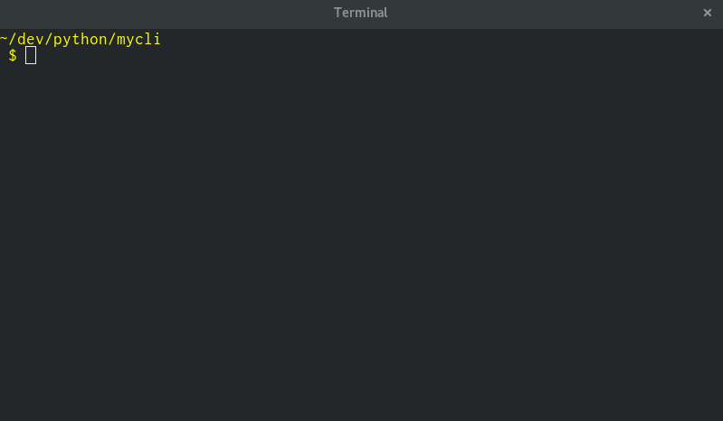

# Verpy

Python application versioning tool

## Setup

This is a Docker-native application (i.e. I developed this with the conscious effort to run it as a container). With that being said, to run it in Docker you'll of course have to have Docker installed and running.

To create the necessary components, simply from `$ . install.sh` from the root of the repo.

*Note: I'm sure with very little work you could get this to run in a virtual environment or (not advised) outside of a virtual environment. If there is interest in this, I would create the script or (better yet) accept a pull request.*

## Usage

- Initialize the version file (`version.py`): `$ verpy init`
- Display the current version: `$ verpy version`
- Increment the *major* component of the version: `$ verpy version major`
- Increment the *minor* component of the version: `$ verpy version minor`
- Increment the *patch* component of the version: `$ verpy version patch`

- Display help: `$ verpy --help` or `$ verpy`
- Display the Verpy version: `$ verpy --version`

## Updates

This happens automatically. If you run `$ type verpy` you'll see that the shell function does a `docker pull`.
